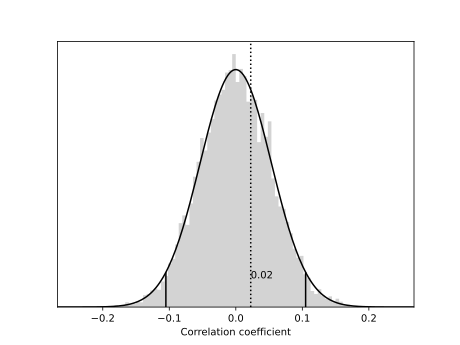

mantel
======

Python implementation of the Mantel test (Mantel, 1967), which is a significance test of the correlation between two distance matrices.


Installation
------------

The `mantel` package is available on PyPI and can be installed using `pip`:

```shell
$ pip install mantel
```

Once installed, the package can be imported in the normal way:

```python
import mantel
```


Usage
-----

The `mantel` package contains one main function, `test()` with the following call signature:

```python
def test(X: array_like, Y: array_like, perms: int = 10000, method: str = "pearson",
		tail: str = "two-tail", ignore_nans: bool = False) -> MantelResult:

```

- `X` *array_like*: First distance matrix (condensed or redundant).
- `Y` *array_like*: Second distance matrix (condensed or redundant), where the order of elements corresponds to the order of elements in *X*.
- `perms` *int*, optional: The number of permutations to perform (default: `10000`). A larger number gives more consistent results but takes longer to run. If the number of possible permutations of the distance matrix is smaller than `perms`, all possible permutations will be enumerated leading to a deterministic result (this can be forced by setting `perms` to `0`).
- `method` *str*, optional: Type of correlation coefficient to use; either `pearson` or `spearman` (default: `pearson`).
- `tail` *str*, optional: Which tail to test in the calculation of the empirical p-value; either `upper`, `lower`, or `two-tail` (default: `two-tail`).
- `ignore_nans` *bool*, optional: Ignore `np.nan` values in the *Y* matrix (default: `False`). This can be useful if you have missing values in one of the matrices.

The function returns a `MantelResult` object with the following properties:

- `MantelResult.r` *float*: Veridical correlation
- `MantelResult.p` *float*: Empirical p-value
- `MantelResult.z` *float*: Standard score (z-score)
- `MantelResult.stochastic_test` *bool*: `True` if the test was performed by randomly sampling possible permutations; `False` if the test was performed by enumerating all possible permutations.
- `MantelResult.correlations` *array*: Correlation coefficients produced by the test
- `MantelResult.mean` *float*: Mean of `correlations`
- `MantelResult.std` *float*: Sample standard deviation of `correlations` (if `stochastic_test==True`) or population standard deviation of `correlations` (if `stochastic_test==False`)


Worked Example
--------------

Let’s say we have a set of four objects and we want to correlate *X* (the distances between the four objects using one measure) with *Y* (the corresponding distances between the four objects using another measure). For example, your “objects” might be species of animal, and your two measures might be genetic distance and geographical distance (the hypothesis being that species that live far away from each other will tend to be more genetically different).

For four objects, there are six pairwise distances. First you should compute the pairwise distances for each measure and store the distances in two condensed or redundant distance matrices (the `test()` function will accept either format). No distance functions are included in this package, since the metrics you use will be specific to your particular data.

Let’s say our data looks like this:

```python
#         E.g. species A through D
#         A~B  A~C  A~D  B~C  B~D  C~D
dists1 = [0.2, 0.4, 0.3, 0.6, 0.9, 0.4] # E.g. genetic distances
dists2 = [0.3, 0.3, 0.2, 0.7, 0.8, 0.3] # E.g. geographical distances
```

We pass the data to the `test()` function and optionally specify the number of permutations to test against, a correlation method to use (either ‘pearson’ or ‘spearman’), and which tail to test (either ‘upper’, ‘lower’, or ‘two-tail’). In this case, we’ll use the Pearson correlation and test the upper tail, since we’re expecting to find a positive correlation.

```python
result = mantel.test(dists1, dists2, perms=10000, method='pearson', tail='upper')
```

This will measure the veridical Pearson correlation between the two sets of pairwise distances. It then repeatedly measures the correlation again and again under permutations of one of the distance matrices to produce a distribution of correlations under the null hypothesis. In the example above, we requested 10,000 permutations (the default). However, for four objects there are only 4! = 24 possible permutations of the matrix. In such a scenario, where the number of requested permutations is greater than the number of possible permutations, `mantel.test()` simply tests against all possible permutations of the matrix, yielding a deterministic result.

Printing the result shows the veridical correlation, empirical p-value, and z-score:

```python
print(result)
# MantelResult(0.9148936170212766, 0.041666666666666664, 2.040402492261023)
```

Individual results can be accessed by the relevant property name. For example, to check if the veridical correlation is significant, we could do:

```python
print(result.p < 0.05)
# True
```

Since the p-value is less than 0.05, we can conclude that there is a significant correlation between the two sets of distances. This suggests that the species that live closer together tend to be more genetically related, while those that live further apart tend to be less genetically related.


Plotting
--------

The `mantel` package also provides a `plot()` function, which plots the distribution of sample correlations against the veridical. For example, here we generate two random distance matrices and plot the results:

```python
dists1 = np.random.random(351)
dists2 = np.random.random(351)

result = mantel.test(dists1, dists2)

fig, axis = mantel.plot(result)
fig.savefig('example.svg')
```




The `plot()` function has several other arguments for customization:

- `alpha` *float*: Significance level for rejecting the null hypothesis (default: 5%)
- `hist_color`*str*: Color used for the histogram bars (default: 'lightgray').
- `gaussian_color` *str*:  Color used for the normal distribution curve and the confidence interval limits (default: 'black').
- `acceptance_color` *str*: Color used for drawing the vertical line and the label of the veridical correlation if the null hypothesis is rejected according to the significance level value (default: 'black').
- `rejection_color` *str*: Color used for drawing the vertical line and the label of the veridical correlation if the null hypothesis cannot be rejected according to the significance level value (default: 'black').


License
-------

This package is licensed under the terms of the MIT License.


References and Links
--------------------

Mantel, N. (1967). The detection of disease clustering and a generalized regression approach. *Cancer Research*, *27*(2), 209–220.

*Mantel Test* on Wikipedia: https://en.wikipedia.org/wiki/Mantel_test

A guide to the Mantel test for linguists: https://joncarr.net/s/a-guide-to-the-mantel-test-for-linguists.html