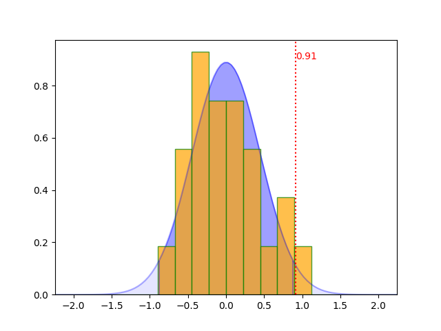

mantel
======

Python implementation of the Mantel test (Mantel, 1967), which is a
significance test of the correlation between two distance matrices.


Installation
------------

The `mantel` package can be installed using `pip`:

```shell
pip install mantel
```

Usage
-----

The `mantel` library provides both a classical imperative procedural
API and an object oriented programming API. 

The historical function (and probably the one you want to use) is,
`test()`, which takes the following arguments:

- `X` *array_like*: First distance matrix (condensed or redundant).
- `Y` *array_like*: Second distance matrix (condensed or redundant),
  where the order of elements corresponds to the order of elements in
  X.
- `perms` *int*, optional: The number of permutations to perform
  (default: `10000`). A larger number gives more reliable results but
  takes longer to run. If the number of possible permutations is
  smaller, all permutations will be tested. This can be forced by
  setting `perms` to `0`.
- `method` *str*, optional: Type of correlation coefficient to use;
  either `'pearson'` or `'spearman'` (default: `'pearson'`).
- `tail` *str*, optional: Which tail to test in the calculation of the
  empirical *p*-value; either `'upper'`, `'lower'`, or `'two-tail'`
  (default: `'two-tail'`).
- `ignore_nans` *bool*, optional: Ignore `np.nan` values in the Y
  matrix (default: `False`). This can be useful if you have missing
  values in one of the matrices.

The `mantel.test()` function returns three values:

- `r` *float*: Veridical correlation.
- `p` *float*: Empirical *p*-value.
- `z` *float*: Standard score (*z*-score).


Another available function is `plot_correlations()` which plots the
correlations previously computed (see `mantel.compute_correlations()`
function below) on the given `matplotlib` axes, as well as the
theoretical normal distribution (with its confidence interval
highlighted).

This function takes the following parameters:

- `correlations` *array of floats*: The correlations computed by the
  `mantel.compute_correlations()` function.
- `plot` *matplotlib.axes.Axes*: The `matplotlib` figure to draw on.
- `tail` *str*, optional: Which tail to test in the calculation of the
  empirical *p*-value; either `'upper'`, `'lower'`, or `'two-tail'`
  (default: `'two-tail'`).
- `significance_level` *float* (in `]0; 1[`): Significance level of
  the null hypothesis of the Mantel test (default: 5%).
- `gaussian_background_color` *string*: Color used for painting the
  area under the normal distribution curve (default: `'blue'`).
- `gaussian_background_alpha` *float*: Opacity (alpha channel) of the
  area under the normal distribution curve (default: 0.1 -- should be
  in [0, 1]).
- `gaussian_color` *string*: Color used for painting the area of the
  confidence interval under the normal distribution curve (default:
  `'blue'`).
- `gaussian_alpha` *float*: Opacity (alpha channel) of the area of the
  confidence interval under the normal distribution curve (default:
  0.3 -- should be in [0, 1]).
- `gaussian_curve_color` *string*: Color used for painting the normal
  distribution curve and the confidence interval limits (default:
  `'blue'`).
- `gaussian_curve_alpha` *float*: Opacity (alpha channel) of the
  normal distribution curve and the confidence interval limits
  (default: 0.3 -- should be in [0, 1]).
- `hist_fill_color` *string*: Color used for filling the correlations
  histogram bars (default: `'orange'`).
- `hist_alpha` *float*: Opacity (alpha channel) of the correlations
  histogram bars (default: 0.7 -- should be in [0, 1]).
- `hist_edge_color` *string*: Color used for drawing the correlations
  histogram bar edges (default: `'green'`).
- `acceptance_color` *string*: Color used for drawing the vertical
  line and the label of the veridical correlation if the null
  hypothesis is accepted according to the significance level value
  (default: `'green'`).
- `rejection_color` *string*: Color used for drawing the vertical line
  and the label of the veridical correlation if the null hypothesis is
  rejected according to the significance level value (default:
  `'red'`).

Calling the `mantel.plot_correlations()` function will raise an
exception if the `matplotlib` library isn't available.

The `mantel.plot_correlations()` function returns two values:

- `min_correlation` *float*: Minimal correlation value to accept the
  null hypothesis.
- `max_correlation` *float*: Maximal correlation value to accept the
  null hypothesis.


The last function provided by the API whose parameters are almost the
same as the `test()` function is the function
`compute_correlations()`, which takes two distance matrices (either
redundant matrices or condensed vectors) and computes the correlation
between symmetric permutations two distance matrices:

- `X` *array_like*: First distance matrix (condensed or redundant).
- `Y` *array_like*: Second distance matrix (condensed or redundant),
  where the order of elements corresponds to the order of elements in
  `X`.
- `perms` *int*, optional: The number of permutations to perform
  (default: `10000`). A larger number gives more reliable results but
  takes longer to run. If the number of possible permutations is
  smaller, all permutations will be tested. This can be forced by
  setting `perms` to `0`.
- `method` *str*, optional: Type of correlation coefficient to use;
  either `'pearson'` or `'spearman'` (default: `'pearson'`).
- `ignore_nans` *bool*, optional: Ignore `np.nan` values in the Y
  matrix (default: `False`). This can be useful if you have missing
  values in one of the matrices.

The `mantel.compute_correlations()` function returns an array of
floats:

- `correlations` *array of floats*: Computed correlation coefficients
  between symmetric permutations two distance matrices. The first
  element of the array is the veridical correlation. The array size is
  the number of computed permutations (see 'perms' parameter).


Another way to perform a Mantel test is to use the object oriented
programming API.

A Mantel instance is built using almost the same parameters as the
`test()` function:

- `X` *array_like*: First distance matrix (condensed or redundant).
- `Y` *array_like*: Second distance matrix (condensed or redundant),
  where the order of elements corresponds to the order of elements in
  `X`.
- `permutations` *int*, optional: The number of permutations to
  perform (default: `10000`). A larger number gives more reliable
  results but takes longer to run. If the number of possible
  permutations is smaller, all permutations will be tested. This can
  be forced by setting `perms` to `0`.
- `method` *str*, optional: Type of correlation coefficient to use;
  either `'pearson'` or `'spearman'` (default: `'pearson'`).
- `ignore_nans` *bool*, optional: Ignore `np.nan` values in the Y
  matrix (default: `False`). This can be useful if you have missing
  values in one of the matrices.
- `tail` *str*, optional: Which tail to test in the calculation of the
  empirical *p*-value; either `'upper'`, `'lower'`, or `'two-tail'`
  (default: `'two-tail'`).
- `significance_level` *float* (in `]0; 1[`): Significance level of
  the null hypothesis of the Mantel test (default: 5%)

Each of these parameter can be retrieve in its final form using
generally the eponym attribute. In the following description, `mt` is
supposed to be an instance of Mantel class and all attributes are
read-only except those explicitly marked as writable:

- `mt.X`: The first distance matrix in condensed form. If the
  correlation in use is the correlation of Spearman (see
  `correlation_method`) then it corresponds to the ranks of the
  distances.
- `mt.Y`: The second distance matrix in condensed form. If the
  correlation in use is the correlation of Spearman (see
  `correlation_method`) then it corresponds to the ranks of the
  distances.
- `mt.permutations`: The number of permutations used. If it was
  greater than the number possible permutations or if the permutations
  parameter was set to 0, then this attribute is the number of
  possible permutations.
- `mt.correlation_method`: The correlation method used to compare the
  input matrices. Currently, only `'pearson'` and `'spearman'` values
  are available.
- `mt.ignore_nans`: If the input matrices contains NaN values and if
  the Mantel test was created setting this parameter to `True`, then
  it is `True`, otherwise it is `False` (even if current instance was
  built with this parameter set to `True`).
- `mt.tail_method` (writable): The way the null hypothesis of the
  Mantel test is tested. The veridical correlation coefficient can be
  tested against the `'lower'` tail of the distribution, the `'upper'`
  tail of the distribution or the `'two-tail'` of the distribution.
- `mt.significance_level` (writable): Significance level of the null
  hypothesis of the Mantel test (necessarily in `]0; 1[`)
- `mt.correlations`: The array containing the correlation coefficients
  computed by the Mantel test. The first element (at index 0) is the
  correlation coefficient of the input distance matrices (see
  `veridical_correlation` attribute).
- `mt.veridical_correlation`: The correlation coefficient of the input
  distance matrices.
- `mt.mean`: The mean of the correlations computed by the current
  Mantel test.
- `mt.std`: The standard deviation of the correlations computed by the
  current Mantel test.
- `mt.p_value`: The current Mantel test empirical *p*-value.
- `mt.z_score`: The current Mantel test *z*-score.
- `mt.confidence_interval`: The confidence interval of the current
  Mantel test.
- `mt.null_hypothesis`: `True` if the current Mantel test result is to
  accept the null hypothesis according to the given significance level
  (and `False` otherwise).

The Mantel objects also can draw themselves on some given
`matplotlib.pyplot.Axes` instance:

- `mt.plot_correlations()` accepts the following parameters:

    - `plot` *matplotlib.pyplot.Axes*: The `matplotlib` figure to draw
      on.
    - `gaussian_background_color` *str*: Color used for painting the
      area under the normal distribution curve (default: `'blue'`).
    - `gaussian_background_alpha` *float* (between [0, 1]): Opacity
      (alpha channel) of the area under the normal distribution curve
      (default: 0.1).
    - `gaussian_color` *str*: Color used for painting the area of the
      confidence interval under the normal distribution curve
      (default: `'blue'`).
    - `gaussian_alpha` *float* (between [0, 1]): Opacity (alpha
      channel) of the area of the confidence interval under the normal
      distribution curve (default: 0.3).
    - `gaussian_curve_color` *str*: Color used for painting the normal
      distribution curve and the confidence interval limits (default:
      `'blue'`).
    - `gaussian_curve_alpha` *float* (between [0, 1]): Opacity (alpha
      channel) of the normal distribution curve and the confidence
      interval limits (default: 0.3).
    - `hist_fill_color` *str*: Color used for filling the correlations
      histogram bars (default: `'orange'`).
    - `hist_alpha` *float* (between [0, 1]): Opacity (alpha channel)
      of the correlations histogram bars (default: 0.7).
    - `hist_edge_color` *str*: Color used for drawing the correlations
      histogram bar edges (default: `'green'`).
    - `acceptance_color` *str*: Color used for drawing the vertical
      line and the label of the veridical correlation if the null
      hypothesis is accepted according to the significance level value
      (default: `'green'`).
    - `rejection_color` *str*: Color used for drawing the vertical
      line and the label of the veridical correlation if the null
      hypothesis is rejected according to the significance level value
      (default: `'red'`).


Example
-------

First import the module:

```python
import mantel
```

Let’s say we have a set of four objects and we want to correlate X
(the distances between the four objects using one measure) with Y (the
corresponding distances between the four objects using another
measure). For example, your “objects” might be species of animal, and
your two measures might be genetic distance and geographical distance
(the hypothesis being that species that live far away from each other
will tend to be more genetically different).

For four objects, there are six pairwise distances. First you should
compute the pairwise distances for each measure and store the
distances in two lists or arrays (i.e. condensed distance
vectors). Alternatively, you can compute the full redundant distance
matrices; this program will accept either format. No distance
functions are included in this module, since the metrics you use will
be specific to your particular data.

Let’s say our data looks like this:

```python
#         E.g. species A through D
#         A~B  A~C  A~D  B~C  B~D  C~D
dists1 = [0.2, 0.4, 0.3, 0.6, 0.9, 0.4] # E.g. genetic distances
dists2 = [0.3, 0.3, 0.2, 0.7, 0.8, 0.3] # E.g. geographical distances
```

We pass the data to the `test()` function and optionally specify the
number of permutations to test against, a correlation method to use
(either ‘pearson’ or ‘spearman’), and which tail to test (either
‘upper’, ‘lower’, or ‘two-tail’). In this case, we’ll use the Pearson
correlation and test the upper tail, since we’re expecting to find a
positive correlation.

```python
mantel.test(dists1, dists2, perms=10000, method='pearson', tail='upper')
```

This will measure the veridical Pearson correlation between the two
sets of pairwise distances. It then repeatedly measures the
correlation again and again under permutations of one of the distance
matrices to produce a distribution of correlations under the null
hypothesis. Finally, it computes the empirical *p*-value (the
proportion of correlations that were greater than or equal to the
veridical correlation) and compares the veridical correlation with the
mean and standard deviation of the correlations to generate a
*z*-score.

In this example, the program will return the following:

```python
# r                    p                     z
(0.91489361702127669, 0.041666666666666664, 2.0404024922610229)
```

Since the *p*-value is less than 0.05 (or alternatively, the *z*-score
is greater than 1.96), we can conclude that there is a significant
correlation between these two sets of distances. This suggests that
the species that live closer together tend to be more genetically
related, while those that live further apart tend to be less
genetically related.

In the example above, we requested 10,000 permutations (the
default). However, for four objects there are only 4! = 24 possible
permutations of the matrix. If the number of requested permutations is
greater than the number of possible permutations (as is the case
here), then the program ignores your request and tests the veridical
against all possible permutations of the matrix. This gives a
deterministic result and can be forced by setting the `perms` argument
to `0`. Otherwise the program randomly samples the space of possible
permutations the requested number of times. This is useful because, in
the case of large matrices, it may be intractable to compute all
possible permutations. For example, for 13 objects, it would take
several days to compute a deterministic result, for 15 objects you’d
be looking at multiple years, and 23 objects would take longer than
the current age of the universe! However, for small matrices, a
deterministic result should be preferred, since it is reproducible.


Another way to get intermediary informations is to first compute the
correlation values of the permuted matrices:

```python
correlations = mantel.compute_correlations(dists1, dists2, perms=10000, method="pearson")
```

This will return the following array:
```python
# correlations
array([ 0.91489362,  0.78723404,  0.11702128,  0.46808511,  0.21276596,
        0.69148936, -0.4893617 , -0.36170213, -0.58510638, -0.42553191,
       -0.68085106, -0.64893617, -0.32978723, -0.36170213,  0.37234043,
       -0.10638298,  0.43617021, -0.0106383 , -0.10638298, -0.26595745,
        0.14893617, -0.20212766,  0.30851064,  0.11702128])
```

The `mantel.plot_correlations()` allows to generate the histogram of
correlation coefficients (thanks to the `matplotlib` library).

```python
import matplotlib.pyplot as plt
mantel.plot_correlations(correlations, plt.subplot())
plt.savefig("example.png")
plt.show()
```

This code generates the following figure




The object oriented programming API is an alternative that almost
provides the same functionalities.

```python
t = mantel.Mantel(dists1, dists2, method="pearson", tail="upper")
print((t.veridical_correlation, t.p_value, t.z_score))
t.plot_correlations(plt.subplot())
plt.show()
```


Note about the permutations
---------------------------

As already mentioned, if the number of specified permutations is 0 or
greater than the number of possible permutations, all the symmetric
permutations of the input matrices are tested (including the input
matrices themselves). In the other cases, the specified number of
permutation minus one are performed, and the input matrices comparison
is added to the sample (another formulation is to say that the
identity permutation is always included in the sample). This way, the
empirical *p*-value consider the input matrices into account as
expected (see ["A Note on the Calculation of Empirical *P* Values from
Monte Carlo Procedures" -- B.V. North, D. Curtis and P.C. Sham in The
American Journal of Human Genetics, Vol. 71(2), 2002,
pp. 439-441](https://doi.org/10.1086/341527)).


License
-------

This package is licensed under the terms of the MIT License.


References and links
--------------------

Mantel, N. (1967). The detection of disease clustering and a
generalized regression approach. *Cancer Research*, *27*(2), 209–220.

*Mantel Test* on Wikipedia: https://en.wikipedia.org/wiki/Mantel_test

A guide to the Mantel test for linguists:
https://joncarr.net/s/a-guide-to-the-mantel-test-for-linguists.html
